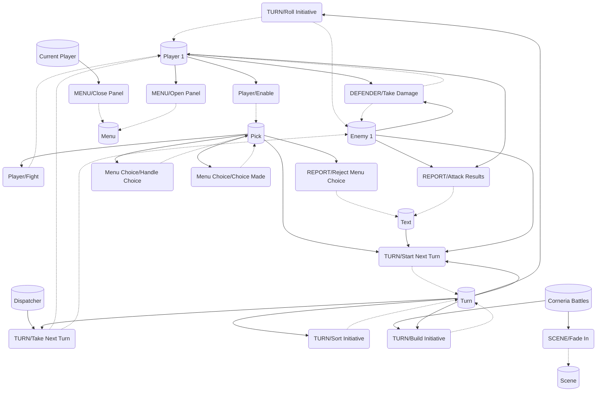

```mermaid
flowchart
a19(TURN/Roll Initiative)-.->9ac61e31-ec75-45a5-bf25-84a0a501eef1[(Player 1)]
a8(TURN/Take Next Turn)-.->9ac61e31-ec75-45a5-bf25-84a0a501eef1[(Player 1)]
a9(DEFENDER/Take Damage)-.->9ac61e31-ec75-45a5-bf25-84a0a501eef1[(Player 1)]
a1(Player/Fight)-.->9ac61e31-ec75-45a5-bf25-84a0a501eef1[(Player 1)]
a19(TURN/Roll Initiative)-.->1fdbce4b-293e-4d6b-9814-999713fe2059[(Enemy 1)]
a9(DEFENDER/Take Damage)-.->1fdbce4b-293e-4d6b-9814-999713fe2059[(Enemy 1)]
a8(TURN/Take Next Turn)-.->1fdbce4b-293e-4d6b-9814-999713fe2059[(Enemy 1)]
a22(TURN/Sort Initiative)-.->d59534e2-c1fe-464b-84f2-1cc8a57fb469[(Turn)]
a16(TURN/Build Initiative)-.->d59534e2-c1fe-464b-84f2-1cc8a57fb469[(Turn)]
a14(TURN/Start Next Turn)-.->d59534e2-c1fe-464b-84f2-1cc8a57fb469[(Turn)]
a20(REPORT/Reject Menu Choice)-.->7ec82437-bd54-4415-85ec-29cfd162b90e[(Text)]
a18(REPORT/Attack Results)-.->7ec82437-bd54-4415-85ec-29cfd162b90e[(Text)]
a10(Player/Enable)-.->7f24e158-f430-43b7-b3b4-0aad714b8f1d[(Pick)]
a21(Menu Choice/Handle Choice)-.->7f24e158-f430-43b7-b3b4-0aad714b8f1d[(Pick)]
a11(Menu Choice/Choice Made)-.->7f24e158-f430-43b7-b3b4-0aad714b8f1d[(Pick)]
a15(MENU/Close Panel)-.->26da9c1f-5ab4-49c1-96da-c6513e769ee3[(Menu)]
a12(MENU/Open Panel)-.->26da9c1f-5ab4-49c1-96da-c6513e769ee3[(Menu)]
a13(SCENE/Fade In)-.->cb73bdaa-9746-4d94-a75a-1b8c23a4239b[(Scene)]
54274c5f-f51d-420e-b717-bd0d155bcef3[(Corneria Battles)]-->a13(SCENE/Fade In)
54274c5f-f51d-420e-b717-bd0d155bcef3[(Corneria Battles)]-->a16(TURN/Build Initiative)
9c19db58-2e7a-44d7-861f-c4544041ec00[(Current Player)]-->a15(MENU/Close Panel)
939cc906-4011-4090-99ce-def3308da22a[(Dispatcher)]-->a8(TURN/Take Next Turn)
7f24e158-f430-43b7-b3b4-0aad714b8f1d[(Pick)]-->a21(Menu Choice/Handle Choice)
7f24e158-f430-43b7-b3b4-0aad714b8f1d[(Pick)]-->a20(REPORT/Reject Menu Choice)
7f24e158-f430-43b7-b3b4-0aad714b8f1d[(Pick)]-->a1(Player/Fight)
7f24e158-f430-43b7-b3b4-0aad714b8f1d[(Pick)]-->a14(TURN/Start Next Turn)
7f24e158-f430-43b7-b3b4-0aad714b8f1d[(Pick)]-->a11(Menu Choice/Choice Made)
7ec82437-bd54-4415-85ec-29cfd162b90e[(Text)]-->a14(TURN/Start Next Turn)
d59534e2-c1fe-464b-84f2-1cc8a57fb469[(Turn)]-->a16(TURN/Build Initiative)
d59534e2-c1fe-464b-84f2-1cc8a57fb469[(Turn)]-->a8(TURN/Take Next Turn)
d59534e2-c1fe-464b-84f2-1cc8a57fb469[(Turn)]-->a19(TURN/Roll Initiative)
d59534e2-c1fe-464b-84f2-1cc8a57fb469[(Turn)]-->a22(TURN/Sort Initiative)
d59534e2-c1fe-464b-84f2-1cc8a57fb469[(Turn)]-->a14(TURN/Start Next Turn)
1fdbce4b-293e-4d6b-9814-999713fe2059[(Enemy 1)]-->a9(DEFENDER/Take Damage)
1fdbce4b-293e-4d6b-9814-999713fe2059[(Enemy 1)]-->a14(TURN/Start Next Turn)
1fdbce4b-293e-4d6b-9814-999713fe2059[(Enemy 1)]-->a18(REPORT/Attack Results)
9ac61e31-ec75-45a5-bf25-84a0a501eef1[(Player 1)]-->a9(DEFENDER/Take Damage)
9ac61e31-ec75-45a5-bf25-84a0a501eef1[(Player 1)]-->a18(REPORT/Attack Results)
9ac61e31-ec75-45a5-bf25-84a0a501eef1[(Player 1)]-->a12(MENU/Open Panel)
9ac61e31-ec75-45a5-bf25-84a0a501eef1[(Player 1)]-->a10(Player/Enable)
```