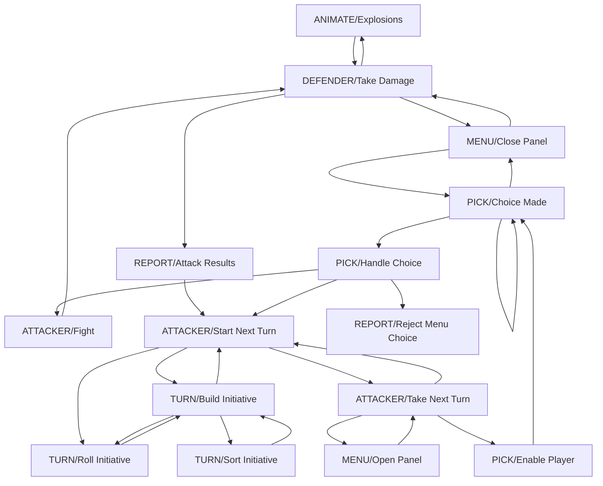

```mermaid
flowchart TD
1[ATTACKER/Fight]-->9[DEFENDER/Take Damage]
8[ATTACKER/Take Next Turn]-->12[MENU/Open Panel]-->8[ATTACKER/Take Next Turn]-->10[PICK/Enable Player]
9[DEFENDER/Take Damage]-->0[ANIMATE/Explosions]-->9[DEFENDER/Take Damage]-->15[MENU/Close Panel]-->9[DEFENDER/Take Damage]-->18[REPORT/Attack Results]
10[PICK/Enable Player]-->11[PICK/Choice Made]-->
11[PICK/Choice Made]-->15[MENU/Close Panel]-->11[PICK/Choice Made]-->21[PICK/Handle Choice]
14[ATTACKER/Start Next Turn]-->16[TURN/Build Initiative]
14[ATTACKER/Start Next Turn]-->8[ATTACKER/Take Next Turn]-->14[ATTACKER/Start Next Turn]-->19[TURN/Roll Initiative]
16[TURN/Build Initiative]-->19[TURN/Roll Initiative]-->16[TURN/Build Initiative]-->22[TURN/Sort Initiative]-->16[TURN/Build Initiative]-->14[ATTACKER/Start Next Turn]
18[REPORT/Attack Results]-->14[ATTACKER/Start Next Turn]
21[PICK/Handle Choice]-->1[ATTACKER/Fight]
21[PICK/Handle Choice]-->20[REPORT/Reject Menu Choice]
21[PICK/Handle Choice]-->14[ATTACKER/Start Next Turn]
```