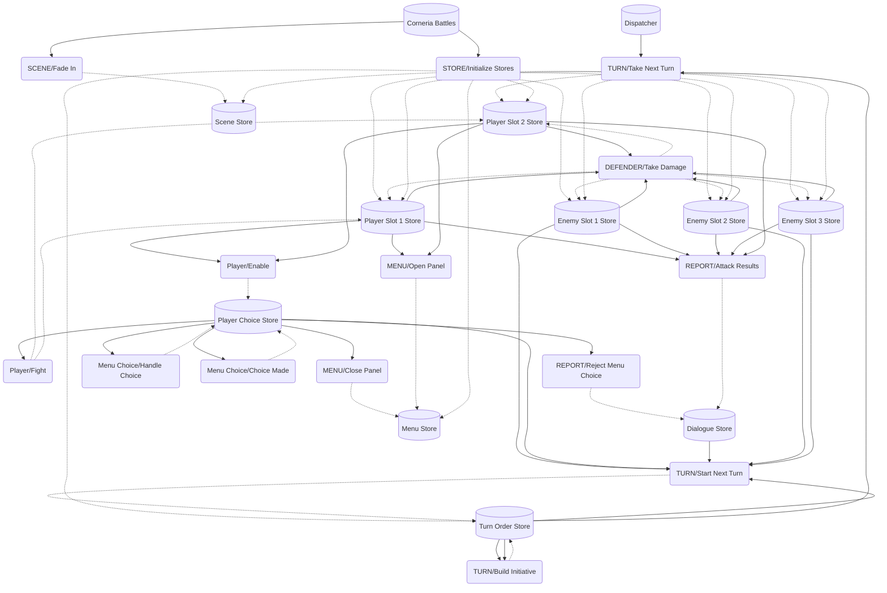

```mermaid
%%{ init: { 'flowchart': { 'curve': 'catmullRom' } } }%%
flowchart TD
a8(TURN/Take Next Turn)-.->1d2b8415-25a9-44fe-8843-6e86b60f76df[(Player Slot 2 Store)]
a9(DEFENDER/Take Damage)-.->1d2b8415-25a9-44fe-8843-6e86b60f76df[(Player Slot 2 Store)]
a1(Player/Fight)-.->1d2b8415-25a9-44fe-8843-6e86b60f76df[(Player Slot 2 Store)]
a0(STORE/Initialize Stores)-.->1d2b8415-25a9-44fe-8843-6e86b60f76df[(Player Slot 2 Store)]
a0(STORE/Initialize Stores)-.->b1485b54-946e-4c56-9971-ceef4c138eff[(Enemy Slot 3 Store)]
a9(DEFENDER/Take Damage)-.->b1485b54-946e-4c56-9971-ceef4c138eff[(Enemy Slot 3 Store)]
a8(TURN/Take Next Turn)-.->b1485b54-946e-4c56-9971-ceef4c138eff[(Enemy Slot 3 Store)]
a0(STORE/Initialize Stores)-.->9c7813d8-1d8c-4eab-aaaa-6b885a213232[(Enemy Slot 2 Store)]
a9(DEFENDER/Take Damage)-.->9c7813d8-1d8c-4eab-aaaa-6b885a213232[(Enemy Slot 2 Store)]
a8(TURN/Take Next Turn)-.->9c7813d8-1d8c-4eab-aaaa-6b885a213232[(Enemy Slot 2 Store)]
a16(TURN/Build Initiative)-.->82583aa5-bc2f-4df9-9739-28dbdfb81f7b[(Turn Order Store)]
a14(TURN/Start Next Turn)-.->82583aa5-bc2f-4df9-9739-28dbdfb81f7b[(Turn Order Store)]
a0(STORE/Initialize Stores)-.->82583aa5-bc2f-4df9-9739-28dbdfb81f7b[(Turn Order Store)]
a20(REPORT/Reject Menu Choice)-.->29bc472f-2cd1-48f2-aa4c-2cc45d69707c[(Dialogue Store)]
a18(REPORT/Attack Results)-.->29bc472f-2cd1-48f2-aa4c-2cc45d69707c[(Dialogue Store)]
a13(SCENE/Fade In)-.->9804e062-c29c-48b9-a893-f0c02a9b745d[(Scene Store)]
a0(STORE/Initialize Stores)-.->9804e062-c29c-48b9-a893-f0c02a9b745d[(Scene Store)]
a10(Player/Enable)-.->84c0a2e8-6dbd-4f3f-b294-2ce0c30e652b[(Player Choice Store)]
a21(Menu Choice/Handle Choice)-.->84c0a2e8-6dbd-4f3f-b294-2ce0c30e652b[(Player Choice Store)]
a11(Menu Choice/Choice Made)-.->84c0a2e8-6dbd-4f3f-b294-2ce0c30e652b[(Player Choice Store)]
a15(MENU/Close Panel)-.->182a8ca6-c0cd-4216-ae8f-e3c706512a51[(Menu Store)]
a12(MENU/Open Panel)-.->182a8ca6-c0cd-4216-ae8f-e3c706512a51[(Menu Store)]
a0(STORE/Initialize Stores)-.->182a8ca6-c0cd-4216-ae8f-e3c706512a51[(Menu Store)]
a0(STORE/Initialize Stores)-.->7e890799-3cbc-41dd-80b5-b164b9555ec7[(Enemy Slot 1 Store)]
a9(DEFENDER/Take Damage)-.->7e890799-3cbc-41dd-80b5-b164b9555ec7[(Enemy Slot 1 Store)]
a8(TURN/Take Next Turn)-.->7e890799-3cbc-41dd-80b5-b164b9555ec7[(Enemy Slot 1 Store)]
a8(TURN/Take Next Turn)-.->7e9e2248-0ccc-4df3-aea0-83236a0b7f9d[(Player Slot 1 Store)]
a9(DEFENDER/Take Damage)-.->7e9e2248-0ccc-4df3-aea0-83236a0b7f9d[(Player Slot 1 Store)]
a1(Player/Fight)-.->7e9e2248-0ccc-4df3-aea0-83236a0b7f9d[(Player Slot 1 Store)]
a0(STORE/Initialize Stores)-.->7e9e2248-0ccc-4df3-aea0-83236a0b7f9d[(Player Slot 1 Store)]
54274c5f-f51d-420e-b717-bd0d155bcef3[(Corneria Battles)]-->a0(STORE/Initialize Stores)
54274c5f-f51d-420e-b717-bd0d155bcef3[(Corneria Battles)]-->a13(SCENE/Fade In)
7e9e2248-0ccc-4df3-aea0-83236a0b7f9d[(Player Slot 1 Store)]-->a9(DEFENDER/Take Damage)
7e9e2248-0ccc-4df3-aea0-83236a0b7f9d[(Player Slot 1 Store)]-->a18(REPORT/Attack Results)
7e9e2248-0ccc-4df3-aea0-83236a0b7f9d[(Player Slot 1 Store)]-->a12(MENU/Open Panel)
7e9e2248-0ccc-4df3-aea0-83236a0b7f9d[(Player Slot 1 Store)]-->a10(Player/Enable)
7e890799-3cbc-41dd-80b5-b164b9555ec7[(Enemy Slot 1 Store)]-->a9(DEFENDER/Take Damage)
7e890799-3cbc-41dd-80b5-b164b9555ec7[(Enemy Slot 1 Store)]-->a14(TURN/Start Next Turn)
7e890799-3cbc-41dd-80b5-b164b9555ec7[(Enemy Slot 1 Store)]-->a18(REPORT/Attack Results)
660916d1-1efb-456e-b770-10b9c9a8f913[(Dispatcher)]-->a8(TURN/Take Next Turn)
84c0a2e8-6dbd-4f3f-b294-2ce0c30e652b[(Player Choice Store)]-->a15(MENU/Close Panel)
84c0a2e8-6dbd-4f3f-b294-2ce0c30e652b[(Player Choice Store)]-->a21(Menu Choice/Handle Choice)
84c0a2e8-6dbd-4f3f-b294-2ce0c30e652b[(Player Choice Store)]-->a20(REPORT/Reject Menu Choice)
84c0a2e8-6dbd-4f3f-b294-2ce0c30e652b[(Player Choice Store)]-->a1(Player/Fight)
84c0a2e8-6dbd-4f3f-b294-2ce0c30e652b[(Player Choice Store)]-->a14(TURN/Start Next Turn)
84c0a2e8-6dbd-4f3f-b294-2ce0c30e652b[(Player Choice Store)]-->a11(Menu Choice/Choice Made)
29bc472f-2cd1-48f2-aa4c-2cc45d69707c[(Dialogue Store)]-->a14(TURN/Start Next Turn)
82583aa5-bc2f-4df9-9739-28dbdfb81f7b[(Turn Order Store)]-->a16(TURN/Build Initiative)
82583aa5-bc2f-4df9-9739-28dbdfb81f7b[(Turn Order Store)]-->a16(TURN/Build Initiative)
82583aa5-bc2f-4df9-9739-28dbdfb81f7b[(Turn Order Store)]-->a8(TURN/Take Next Turn)
82583aa5-bc2f-4df9-9739-28dbdfb81f7b[(Turn Order Store)]-->a14(TURN/Start Next Turn)
9c7813d8-1d8c-4eab-aaaa-6b885a213232[(Enemy Slot 2 Store)]-->a9(DEFENDER/Take Damage)
9c7813d8-1d8c-4eab-aaaa-6b885a213232[(Enemy Slot 2 Store)]-->a14(TURN/Start Next Turn)
9c7813d8-1d8c-4eab-aaaa-6b885a213232[(Enemy Slot 2 Store)]-->a18(REPORT/Attack Results)
b1485b54-946e-4c56-9971-ceef4c138eff[(Enemy Slot 3 Store)]-->a9(DEFENDER/Take Damage)
b1485b54-946e-4c56-9971-ceef4c138eff[(Enemy Slot 3 Store)]-->a14(TURN/Start Next Turn)
b1485b54-946e-4c56-9971-ceef4c138eff[(Enemy Slot 3 Store)]-->a18(REPORT/Attack Results)
1d2b8415-25a9-44fe-8843-6e86b60f76df[(Player Slot 2 Store)]-->a9(DEFENDER/Take Damage)
1d2b8415-25a9-44fe-8843-6e86b60f76df[(Player Slot 2 Store)]-->a18(REPORT/Attack Results)
1d2b8415-25a9-44fe-8843-6e86b60f76df[(Player Slot 2 Store)]-->a12(MENU/Open Panel)
1d2b8415-25a9-44fe-8843-6e86b60f76df[(Player Slot 2 Store)]-->a10(Player/Enable)
```